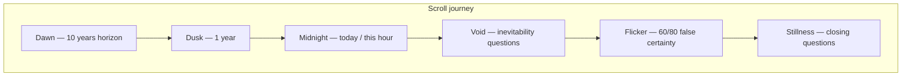

# Introduction to Death 101 — Visual Blog Plan (final)

## What you have

The workspace is greenfield: only [`death.md`](death.md) exists. It is a first-person philosophical essay that compresses mortality through **time horizons** — 10 years, 1 year, today, then questions about readiness, inevitability, false certainty (60/80), and closing fear/acceptance prompts.

That structure is the narrative spine. The site should feel like **time running out**, not a generic dark blog.

---

## Design priorities (in order)

This governs every decision. When in doubt, choose clarity.

1. **Intent first** — The reader must grasp your questions and emotional arc without fighting the UI. Prose is the hero; nothing decorative competes with it.
2. **Theme second** — Temporal descent (time shrinking) supports the message through color, pacing, and subtle metaphor — never overwhelms it.
3. **Motion third** — Scroll reveals and parallax add rhythm; they are seasoning, not the meal. If an effect makes a paragraph harder to read, cut it.
4. **Mobile first, desktop equal** — Phone is the primary canvas (where most readers arrive). Desktop gets the same story with more breathing room — not a different experience.

**Clean means:**
- Generous whitespace and line-height (1.6–1.75 body)
- Narrow reading measure (~38–42rem max on desktop; full width with side padding on mobile)
- One visual idea per section, not stacked effects
- Questions styled as distinct callouts — easy to scan, not buried in animation
- No clutter: no nav bars, sidebars, pop-ups, or "scroll to continue" gimmicks

---

## Honest recommendation (not yes-man)

| Approach | Verdict |
|---|---|
| Plain markdown → static text site | Too weak for your goal |
| Full Awwwards WebGL (Three.js, heavy GSAP) | Wrong fit: text-first essay, mobile cost, conflicts with "vanilla" |
| **Cinematic-light scrollytelling** (your choice) | Best balance: emotional impact without a framework or 3D pipeline |

**Skip React/Vue.** A single long-form scroll story does not need a SPA. **Skip Three.js.** Canvas particles + SVG metaphors carry the mood without WebGL complexity.

**One small CDN dependency is worth it:** [Lenis](https://github.com/darkroomengineering/lenis) for smooth, controlled scroll. Everything else stays vanilla.

---

## Visual concept: **Temporal Descent**

One strong visual idea (Awwwards 2026 pattern: restraint over effect soup):



**Palette progression:** warm amber dawn → muted rust → cold blue-black → near-black with a single warm accent (last light). Transitions are gradual — no jarring section jumps.

**Typography (clarity-first):**
- Body: readable sans (**Source Sans 3** or **Instrument Sans**) — 17–18px base on mobile via `clamp()`
- Display/section cues: serif accent (**Cormorant Garamond**) for short headlines only — not for long paragraphs
- Questions: visually separated callout blocks with left border or subtle background — staggered reveal, never hidden behind scroll tricks

**Motion language (restrained):**
- Background **particle field** (canvas): very subtle; opacity capped low; sits behind text at all times
- **Parallax:** max 15–20px offset on desktop; 8px on mobile — barely perceptible depth
- **Section reveals:** fade + small translateY; one beat per paragraph block, not per word
- **SVG horizon** (hero only): single static motif; optional subtle drain on scroll — skippable if it adds noise

**Accessibility (non-negotiable):**
- `prefers-reduced-motion: reduce` → disable Lenis, static layout, instant text visibility, no particle animation
- Semantic HTML (`main`, `section`, `article`, `h2`, `blockquote`)
- Contrast ratio WCAG AA minimum for all text
- Focus-visible styles; no hover-only interactions

---

## Content architecture

### Rule: death.md is read-only (for the agent)

Create [`.cursor/rules/death-md-readonly.mdc`](.cursor/rules/death-md-readonly.mdc):

```yaml
---
description: death.md is the author's source manuscript — never edit it
globs: death.md
alwaysApply: true
---
- NEVER modify, rename, or delete death.md
- All site content comes from build-time parsing or new files in content/
- To change published text, the author edits death.md manually; re-run build
```

Also add a project-wide rule (`alwaysApply: true`): **new markdown lives in `content/` or is generated — never touch `death.md`.**

**You** own `death.md` and may add, remove, or rewrite sections freely. The site must adapt — not break.

### Flexible build pipeline

[`scripts/build-content.mjs`](scripts/build-content.mjs) reads `death.md` and emits [`src/data/content.json`](src/data/content.json).

**Parser philosophy: resilient, not rigid.**

| Behavior | Old plan | Updated plan |
|---|---|---|
| Missing section markers | Fail build | Graceful fallback: treat as sequential `section-01`, `section-02`, … |
| Added paragraphs | — | Auto-detected; new blocks appear in order |
| Removed sections | — | Site shrinks; theme cycle still works via index position |
| Bullet clusters | Questions block | Same; any `- ...` line group → questions |
| Unknown structure | Error | Warn in console; render everything readable |

**Optional presentation config** — [`content.config.json`](content.config.json) (you edit; agent may help):

```json
{
  "title": "Introduction to Death 101",
  "sectionOverrides": {
    "next 10 year": { "id": "ten-years", "theme": "dawn", "headline": "Ten years — but when?" },
    "next 1 year": { "id": "one-year", "theme": "dusk", "headline": "One year left" }
  },
  "defaultThemeCycle": ["dawn", "dusk", "midnight", "void", "flicker", "stillness"]
}
```

- **Known markers** in config → custom id, theme, headline
- **No match** → auto-section + theme assigned from `defaultThemeCycle` by order
- You can add/remove marker entries when you restructure the essay — no code changes needed

**Generated JSON shape:**

```json
{
  "title": "Introduction to Death 101",
  "sections": [
    {
      "id": "ten-years",
      "theme": "dawn",
      "headline": "Ten years — but when?",
      "blocks": [
        { "type": "paragraph", "text": "..." },
        { "type": "questions", "items": ["..."] }
      ]
    }
  ]
}
```

**Your workflow:**
1. Edit `death.md` (add/remove/rewrite as you like)
2. Optionally tweak `content.config.json` for headlines/themes
3. Run `npm run build` → site updates
4. Agent never writes to `death.md`

**Current manuscript markers** (starting defaults in config, not hard requirements):

| Marker in text | Suggested theme |
|---|---|
| "next 10 year" | dawn |
| "next 1 year" | dusk |
| "die today" / "this exact hour" | midnight |
| "Being born means death" | void |
| "age of 60 or 80" | flicker |
| Final question cluster | stillness |

---

## Tech stack

| Layer | Choice | Why |
|---|---|---|
| Markup | Semantic HTML5 | SEO, a11y, no build framework |
| Style | Plain CSS + custom properties | Mobile-first, theming per section |
| Script | ES modules, no bundler | Keeps it vanilla |
| Smooth scroll | Lenis (CDN) | Premium feel; one justified dependency |
| Animation | CSS + `IntersectionObserver` | Gentle reveals; no GSAP |
| Effects | Canvas particles + inline SVG | Background-only accents |
| Dev | `npm run dev` → static server | Simple local preview |
| Deploy | Static `dist/` folder | GitHub Pages / Netlify / Cloudflare Pages |

---

## File structure

```
introduction-to-death-101/
├── death.md                          # READ ONLY for agent; you edit freely
├── content.config.json               # optional themes/headlines (flexible)
├── .cursor/rules/
│   ├── death-md-readonly.mdc
│   └── project-conventions.mdc
├── package.json
├── scripts/
│   └── build-content.mjs
├── src/
│   ├── index.html
│   ├── data/
│   │   └── content.json              # generated
│   ├── css/
│   │   ├── reset.css
│   │   ├── tokens.css
│   │   ├── layout.css                # mobile-first, clean measure
│   │   ├── sections.css
│   │   └── motion.css
│   └── js/
│       ├── main.js
│       ├── scroll.js
│       ├── parallax.js
│       ├── particles.js
│       └── render.js
├── dist/
└── README.md
```

---

## Page structure (mobile-first, desktop equal)

Single scrolling page — no pagination, no tabs.

1. **Hero** — title + first paragraph only; sets intent immediately
2. **Chapters** — one `<section>` per parsed block group; auto-generated count
3. **Footer** — minimal; scroll-to-top only

**Mobile (base, 320px+):**
- Single column; 1.25rem side padding
- Body `clamp(1rem, 2.5vw, 1.125rem)`; line-height 1.7
- Question callouts: full-width cards with 1rem padding
- Particles: ~25 count, 20% max opacity
- Parallax: disabled or minimal on low-end / small screens via `matchMedia`

**Desktop (`min-width: 768px`):**
- Centered column, max-width ~42rem for prose
- Questions can offset slightly right for visual rhythm — still same reading order
- Particles: ~60 count; parallax up to 20px
- Same font sizes — scale via measure, not size inflation

**Both:** Text always fully readable without scrolling back; no text pinned under fixed overlays.

---

## Implementation phases

### Phase 1 — Foundation (clarity shell)
- Project scaffold + Cursor rules
- Flexible content parser + `content.config.json`
- JSON-driven render with clean semantic HTML
- Base typography and spacing **before** any effects

### Phase 2 — Visual system (theme, not noise)
- CSS tokens: temporal color ramp, spacing scale
- Section themes via `data-theme`; fallback cycle for new/removed sections
- Question callout component
- Mobile-first layout; desktop enhancements at 768px / 1024px

### Phase 3 — Motion layer (restrained)
- Lenis + reduced-motion bypass
- Gentle IntersectionObserver reveals (paragraph-level, not word-level)
- Light parallax on background layers only
- Canvas particles: low opacity, paused when tab hidden

### Phase 4 — Polish + ship
- Hero SVG horizon (if it passes the "does this help intent?" test)
- OG meta for sharing
- README: edit death.md → build → deploy
- Test matrix: iPhone SE width, standard phone, tablet, desktop, reduced-motion

---

## What we are deliberately not doing in v1

- WebGL / Three.js
- React, Astro, Eleventy
- CMS, comments, analytics widgets
- AI rewriting of your prose
- Agent edits to `death.md`
- Hard-failing parser when you restructure text
- Effects that delay or hide text from the reader

---

## Future extensibility

When you write more essays: new source files in `content/` (e.g. `content/essay-two.md`) with their own config entries; simple index page linking to each piece. **`death.md` stays your original manuscript for this essay.**

---

## Success criteria

- A first-time reader understands **your intent and questions** within the first two screens
- Adding or removing a paragraph in `death.md` + rebuild = site updates with no code changes
- Mobile reading feels effortless; desktop feels spacious, not redesigned
- Visual theme reinforces mortality/time without distracting from the words
- `death.md` untouched by agent; rebuild reproduces site from your manuscript
- Reduced-motion users get the full essay instantly, beautifully typeset
- Total custom JS (excl. Lenis) under ~12kb; no framework lock-in

---

## Ready to build

When you say go, implementation starts with Phase 1: rules + scaffold + flexible parser + clean typographic shell — effects come last, only if the reading experience already works.
